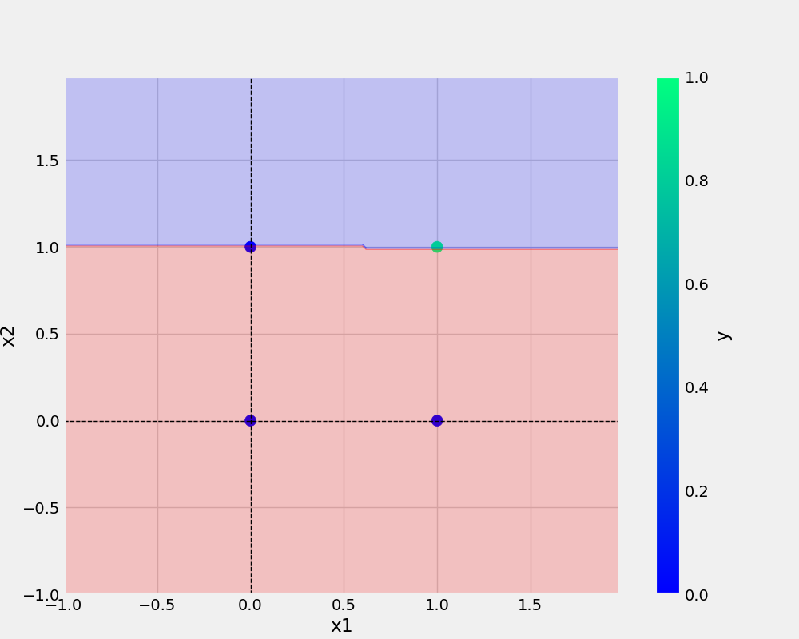

# Perceptron

# commands used -

```bash
git add . && git commit -m "docstring updated" && git push origin main
```
```bash
cp Research\ notebooks/demo.ipynb .
```

## Add URL
[Git Handbook](https://guides.github.com/introduction/git-handbook)

## Add Imange


## AND Dataset
x1 | x2 | y
-|-|-
0|0|0
0|1|0
1|0|0
1|1|1